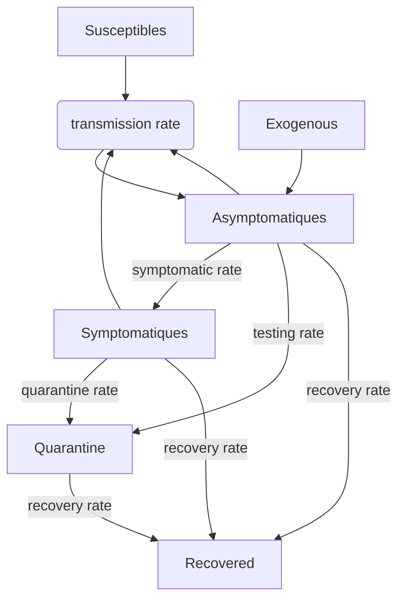

The main objective of this work is to replicate the model presented in "[A simple model for control of COVID-19 infections on an urban campus][article]" by Robert Brown. This article presents a modified SEIR model on COVID-19 transmission on an urban campus and is verified using data collected in Fall 2020. Specifically, by exctracting the data used for the suggested study, we will run the same SEIR model and generate figures 1 to 3 to verify the replicability of the article.

Our objective is to replicate the work presented in “A simple model for control of COVID-19 infections on an urban campus” by Robert A. Brown. In their paper, R. Brown introduced an SEIR compartmental model to describe the impact of a surveillance testing system on COVID-19 transmission on Boston University campus population. The article provides insight on the impact of testing on the dynamics of transmission. Indeed, the author demonstrated a decreased expected number of cases when frequent testing and contact tracing are enforced. Here, we implement the model in the Julia programming language to explore the replicability of the proposed model.

[article]: https://www.ncbi.nlm.nih.gov/pmc/articles/PMC8433581/#r7

R. Brown suggested a SEIR - susceptible-exposed-infectious-recovered - models with 5 compartments;

-	Susceptibles (S)
-	Infectious and symptomatic I(t)
-	Infectious and asymptomatic A(t)
-	Recovered R(t)
-	Quarantine Q(t)

Where susceptibles individuals belonging to the campus community S(t) become infectious and asymptomatic at infection rate β. Infection is transmitted to the susceptible population from infectious and symptomatic individuals I(t) or infectious and asymptomatic individuals A(t) from the campus. However, infection can also be acquired from an external individual, and is therefore represented as an exogenous input of rate E (τ). 

Infectious and symptomatic individuals are placed in quarantine Q(t) at rate fq, while infectious and asymptomatic individuals are placed in quarantine at rate ft when tested positive. The rate at which asymptomatic and infectious individuals are placed into quarantine is regulated by the parameter s which takes into account test sensitivity, indeterminate tests and individuals who miss their tests. Therefore, s is the fraction of I(t) Individuals detected as positive by the testing method and that directly goes into quarantine. All individuals recover at rate fr. 

### Intellectual property

#### Article template

(C) 2015-2020, Nicolas Rougier + co-authors GPL-3+, Apache v2+, SIL Open Font License

This set of template files is free-licensed. The files contained in
the sub-directories roboto/; source-code-pro/; source-sans-pro/;
source-serif-pro/; have their free licences indicated with a
"*License.txt" file. All other files, including this one, are licensed
under the GPL version 3 or later, at your choosing, by Nicolas Rougier
and co-authors, 2015-2020. See the file COPYING for details of the
GPL-3 licence.

#### Model

